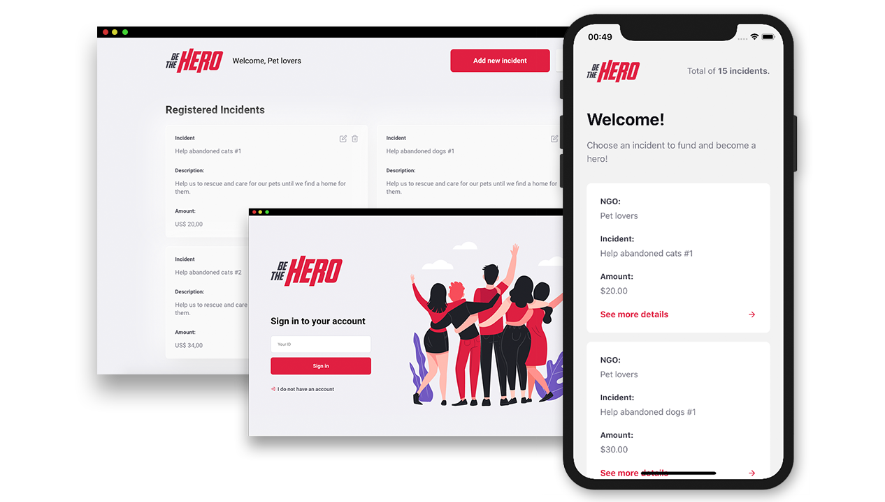

<p align="center">
  
  
  <p align="center">
  App to help NGOs built with ReactJS, React Native, Node.js and more.
  </p>

  

</p>

# App
[Website](https://be-the-hero-app.netlify.com/)

[Server](https://be-the-hero-app.herokuapp.com/ngos)

# Development setup

> yarn is required

After cloning this repo:
### Server 
  - Run ```yarn``` in the ```server``` folder
  - Go back to the root folder
  - Run ```yarn dev:server``` to up the server
  - Open ```Insomnia``` or ```Postman``` and import the ```Insomnia.json``` workspace file at ```server``` folder
  - Use it! :D
### Website
  - Run ```yarn``` in the ```website``` folder
  - Go back to the root folder
  - Run ```yarn dev:web``` to up the project
### Mobile
  - Run ```yarn``` in the ```mobile``` folder
  - Update the ```baseURL``` at ```src/config/index.js```
  - Go back to the root folder
  - Run ```yarn dev:mobile``` to up the project

# Tests
### Server
  - Run ```yarn test:server``` at the root folder

# License
[MIT License](/LICENSE)
